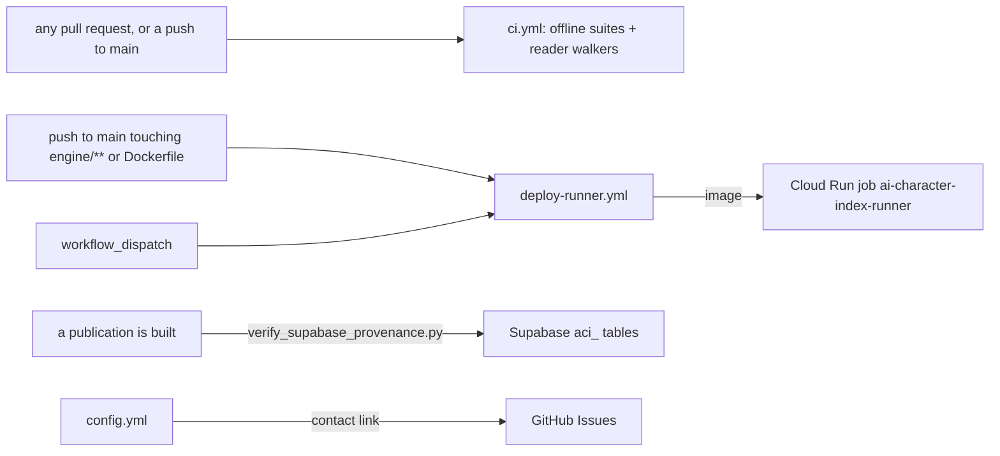

# .github: PR-time verification and the judging image's deploy

> Current-state doc, as of September 2026: describes what exists now, not what should exist.

## Purpose
`.github/` holds two workflows: PR-time verification (`ci.yml`) and the judging image's deploy (`deploy-runner.yml`). The published data is checked by `engine/verify_supabase_provenance.py --publication=<uuid>`, run when a publication is built rather than on a schedule here: the Supabase service role key is not a GitHub secret. The site has no workflow: it is a Next.js application that Vercel builds on a push. The public inbound channel is the contact link on the repo's Issues page (`ISSUE_TEMPLATE/config.yml` enables blank issues and the mailto link).

## Contents
| Path | What it is |
|---|---|
| `workflows/ci.yml` | PR-time verification: the offline suites (panel, judging job, store and index, `tests/`, application libraries, app.js harnesses) + the two Playwright reader walkers against an installed Chrome. No secrets, `contents: read` only |
| `workflows/deploy-runner.yml` | On a push to `main` touching `engine/**`, the Dockerfile or itself, and on demand: builds the judging image, pushes it to Artifact Registry and points the `ai-character-index-runner` Cloud Run job at it, authenticating through workload identity federation |
| `workflows/README.md` | Operator notes for the two workflows and the Vercel deployment |
| `ISSUE_TEMPLATE/config.yml` | Blank issues enabled; mailto contact link (andrescotton@gmail.com) |

## Relationships
- `ci.yml` triggers on every `pull_request` and on `push` to `main`, deliberately without a paths filter (a filtered required check would skip PRs outside its paths and block merging). Two jobs: `offline` (stdlib python + node, nothing installed) and `browser` (pnpm deps + `browser-actions/setup-chrome`, then the two walkers).
- CI verifies the code against fixtures and knows no secret; `engine/verify_supabase_provenance.py` verifies the published data and is the thing that reads Supabase, run at publication time rather than from a workflow.
- `deploy-runner.yml` reads repository variables (`WIF_PROVIDER`, `DEPLOY_SA`, `GCP_PROJECT`, `GCP_REGION`); the workload identity provider and its attribute condition are defined in `polaris-tf`.
- Vercel deploys `main` to production and other branches as previews, outside these workflows.
- Proposals go through `/how-it-works`; the contact link is for anything else, and GitHub surfaces it through the Issues form picker via `config.yml`.

## Dependency map

## As-is observations
- `deploy-runner.yml` has not once succeeded (14 runs as of 15 September 2026). It fails at `google-github-actions/auth`: the workload identity provider rejects the token by its attribute condition. Jobs are run from a local portal with `ACI_PYTHON` set instead.
- `engine/verify-portal.mjs` needs credentials, and no workflow runs it.
- `engine/notion-sync/` contains only `.gitkeep`, and `engine/spec-watch/pull-latest.sh` no longer runs; no workflow invokes either.
