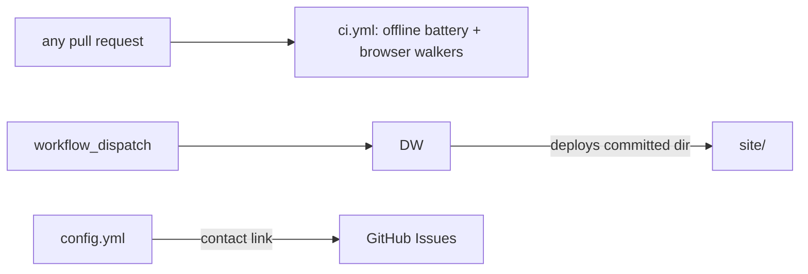

# .github — PR-time verification + production deploy workflows

> Current-state doc: describes what exists now, not what should exist. Brought current with the Phase-2 stack (#28–#49) and the CI landing.

## Purpose
`.github/` holds the repo's CI — PR-time verification (`ci.yml`). There is no deploy workflow: the site is a Next.js application and Vercel builds it on a push. The public inbound channel is the contact link on the repo's Issues page (`ISSUE_TEMPLATE/config.yml` enables blank issues and the mailto link).

## Contents
| Path | What it is |
|---|---|
| `workflows/ci.yml` | PR-time verification: offline battery (panel/provenance/cite/registry suites, data gate, byte-identity rebuilds, publish checks, app.js harnesses) + the three Playwright walkers against an installed Chrome. No secrets, `contents: read` only |
| `workflows/README.md` | Operator docs: `ci.yml` jobs; deploy secrets setup; `notion-sync.yml` / `spec-watch.yml` still to come |
| `ISSUE_TEMPLATE/config.yml` | Blank issues enabled; mailto contact link (andrescotton@gmail.com) |

## Relationships
- `ci.yml` triggers on every `pull_request` and on `push` to `main`, deliberately without a paths filter (a filtered required check would skip PRs outside its paths and block merging). Two jobs: `offline` (stdlib python + node, nothing installed) and `browser` (pnpm deps + `browser-actions/setup-chrome`, then the three walkers).
- The deploy has no build step: `site/` is committed static output, and the paths filter watches `site/**` only, so `data/**` or `engine/**` changes trigger nothing until they are baked into `site/`.
- Inbound corrections/questions go through the contact link named in `README.md`'s "Contributing" section; GitHub surfaces it through the Issues form picker via `config.yml`.

## Dependency map

## As-is observations
- `engine/notion-sync/` contains only `.gitkeep`: the Notion sync engine promised by PLAN.md §1.2/§6 Phase 3 has no code.
- `engine/spec-watch/pull-latest.sh` exists and is used, but manually; no workflow invokes it.
- `data/schema/` holds a JSON Schema per canonical `data/*.json` file, enforced by `engine/validate_data.py` — locally and in CI (`ci.yml`'s offline job runs the gate), meeting the PLAN.md §2/§5 promise to validate `data/*.json` against schemas on each PR.
- There is no per-PR preview deploy; production deploys fire only post-merge.
