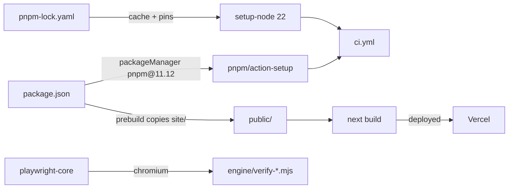

# Repo root — plan, front-door README, and the Next.js application that serves the site

> Current-state doc: describes what exists now, not what should exist. Brought current when the site moved from Cloudflare Pages to a Next.js application on Vercel.

## Purpose
The root holds the project's two entry documents (`PLAN.md`, `README.md`) and the Next.js application that serves the site: `app/` for its two reader routes, `next.config.mjs`, and a pnpm setup carrying Next and React (plus `playwright-core` for the engine's reader checks).

## Contents
| File | Role |
|---|---|
| `PLAN.md` | Build plan & system design (written 2026-07-10): three-layer architecture, data model, page map, CI/CD table (§5), build phases (§6), repo map (§8). The source of the "what should exist" claims cross-checked in this doc set |
| `README.md` | Front door: positioning paragraph, short how-it-works, repo-map table, Contributing points to the Issues-page contact link |
| `package.json` | Root package `ai-character-index` (private); `packageManager: pnpm@11.12.0`; `engines.node >= 22`; scripts: `dev`/`build`/`start` for Next, `test:routes`, and the `predev`/`prebuild` pair that copies `site/` into the gitignored `public/`; deps: `next`, `react`, `react-dom`; devDep: `playwright-core ^1.61.1` |
| `pnpm-workspace.yaml` | Declares no packages; only `allowBuilds` (esbuild, sharp, workerd) — the pnpm ≥10 allowlist for transitive deps that run postinstall builds |
| `pnpm-lock.yaml` | Lockfile v9; exactly one importer (`.` = root) |
| `.gitignore` | Standard entries (node_modules, dist, .env, logs, .DS_Store), `.claude/` local settings, local panel run outputs (timestamped payloads + `manifest.json`; runlogs/metrics via `engine/panel/.gitignore`), user-registered specs (`specs/user/`), builder smoke scratch, plus two repo-specific private paths: `research/sources/Founding an AI Charter organisation.pdf` and `outreach/` |

## Relationships
- The site is a Next.js application, deployed to Vercel. `site/` remains the reader's source and is copied into `public/` by `predev`/`prebuild`; `public/` is gitignored, so the tracked tree has one copy of the reader and not two.
- In `ci.yml`, `pnpm/action-setup@v4` reads `packageManager` from `package.json`, and `actions/setup-node` caches against `pnpm-lock.yaml` (pnpm 11.12 needs Node ≥ 22.13, hence `node-version: 22`).
- `playwright-core` is consumed by `engine/verify-reader-test.mjs` and `engine/verify-reader-features.mjs` (both `import { chromium } from "playwright-core"`); the browser job of `.github/workflows/ci.yml` runs them.
- `README.md`'s repo-map links resolve in the post-merge tree (`SYSTEM.md` is added by this documentation set; `outreach/` is gitignored and unlinked): `research/` (+ `core-behaviour-list.md`), `.claude/skills/` (+ its README), `specs/`, `methodology/`, `data/` (+ `data/README.md`), `engine/` (+ `engine/README.md`), `site/`, `design/`, `vision/` (+ `features to build.md`); the README points onward to `SYSTEM.md` for the system map and frames `PLAN.md` as the original design.

## Dependency map

## As-is observations
- The "pnpm workspace" is the root package alone: `pnpm-workspace.yaml` has no `packages:` key and `pnpm-lock.yaml` has a single importer.
- PLAN.md §8's repo map lists `outreach/` as a repo folder, but `.gitignore` excludes `outreach/` — it can only exist in local clones, never on main.
- PLAN.md §5's CI/CD table promises `ci.yml`, `notion-sync.yml`, `spec-watch.yml` alongside a deploy workflow; only `ci.yml` exists now — deployment is Vercel's, fired by a push rather than by a workflow here (see `.github/OVERVIEW.md`).
- `engines`/`scripts` nothing calls: none — `playwright-core` is used by the two `engine/verify-*.mjs`, in CI's browser job and locally.
- Node version tension: `package.json` declares `engines.node >=22`, but pnpm 11.12 needs Node ≥ 22.13 — Node 22.0–22.12 satisfies `engines` yet not the pinned packageManager. CI's `node-version: 22` resolves to the latest 22.x, which clears 22.13; the `engines` floor is simply looser than reality.
