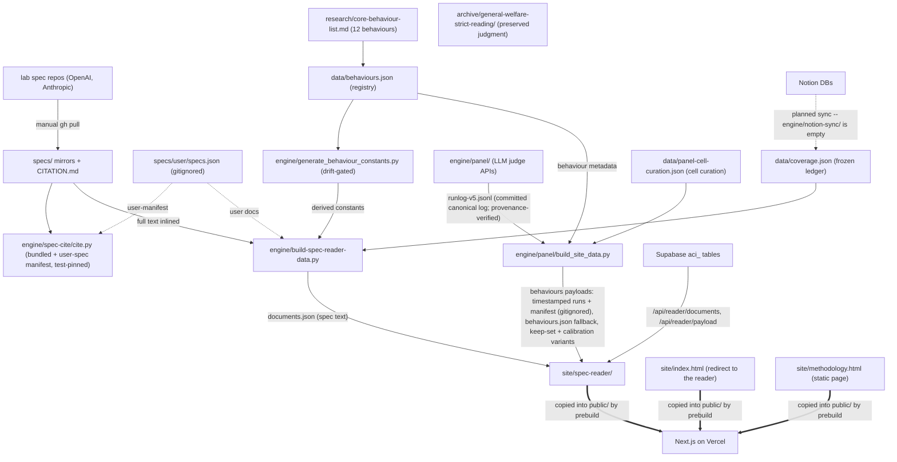

# SYSTEM — global map of the AI Character Index repository

> Current-state doc, plus the branch/local territory documented in `experiments-branches.md`. Describes what exists now, not what should exist. Each directory has its own `OVERVIEW.md`; this file stitches them together.

> **Scope (repo-owner decision):** the deliverable is the **model spec reader only** — behaviour × spec coverage with cited passages. The eval-discovery/quality workflow (sweep stages 1–3, `evals.json`, `sources/`, evidence-strength lens) is outside the deliverable and was deleted by the scope ruling (2026-08-19). This document maps the whole repo as-is; in/out rulings and removal tasks are tracked in [CLOSEOUT-LIST.md](CLOSEOUT-LIST.md).

## What the system is

An index of AI character: **behaviours** (a canonical list) × **model-spec coverage** (cited verdicts against lab specs), published as a Next.js application on Vercel whose two reader routes read the index out of Supabase. git is no longer the gate: the artifacts live in the `aci_` tables and a publication row decides what the reader shows. The LLM-panel pipeline does the active knowledge production; the coverage ledger (`data/coverage.json`) is frozen — it still feeds the reader builder's index behaviour set, but nothing writes it any more. Behaviour identity is registry-driven (`data/behaviours.json`); users can register their own specs and behaviours locally (the clone/fork pathway — `specs/user/specs.json` + `set:user` registry entries, nothing pushed back).

## Global dependency map

## Component catalogue

| Directory | One-line role | Detail |
|---|---|---|
| `.claude/skills/` | Retired procedure layer: no live skills; index files record the retirement (root `AGENTS.md` points here) | [.claude/skills/OVERVIEW.md](.claude/skills/OVERVIEW.md) |
| `engine/` | Automation: citation resolution, LLM panel judging, payload builders, E2E + feature-harness verifiers | [engine/OVERVIEW.md](engine/OVERVIEW.md) |
| `data/` | Canonical machine-readable data: behaviour registry, coverage ledger (frozen), labs, schema/ | [data/OVERVIEW.md](data/OVERVIEW.md) |
| `specs/` | Version-pinned lab-spec mirrors + locator grammar | [specs/OVERVIEW.md](specs/OVERVIEW.md) |
| `research/` | Canonical behaviour list | [research/OVERVIEW.md](research/OVERVIEW.md) |
| `archive/` | Preserved analytical artifact: the cross-spec strict-reading judgment (self-describing README inside) | — |
| `methodology/` | Depth rubric, public site copy, method-exploration findings | [methodology/OVERVIEW.md](methodology/OVERVIEW.md) |
| `site/` | Two static surfaces, no build step | [site/OVERVIEW.md](site/OVERVIEW.md) |
| `.github/` | One CI workflow + Issues-page contact link | [.github/OVERVIEW.md](.github/OVERVIEW.md) |
| `design/`, `vision/` | Settled-design log (Jul 2026) and the originating brief | [design/OVERVIEW.md](design/OVERVIEW.md), [vision/OVERVIEW.md](vision/OVERVIEW.md) |
| root files | PLAN.md, README.md, the Next.js application and its two reader routes | [ROOT.md](ROOT.md) |
| branch/local territory | Experiment branches, parked CI work, local-only branches | [experiments-branches.md](experiments-branches.md) |

## System-level contracts (the tissue between components)

HEAD
1. **Locator grammar** — `specs/CITATION.md` defines the format; `cite.py` implements it (bundled specs + optional user manifest); every stored citation in `data/` and site payloads depends on byte-exact resolution. CI re-resolves on every PR (the `tests/` suite re-resolves every published locator through `cite.py`; `tests/test_coverage_json.py` byte-compares every quote in the frozen ledger).
2. **Behaviour identity** — registry-driven since #28: `data/behaviours.json` is the source of truth; `engine/generate_behaviour_constants.py` regenerates the derived constants (`build-spec-reader-data.py BEHAVIOURS`, the judge-prompt titles in `engine/panel/behaviours.json` -- keys are registry slugs, the same slugs the panel runlogs are keyed by), with `tests/test_behaviour_registry.py` as the drift gate. `behaviour_id` remains **file-local across disjoint numbering spaces** (id 1 = "No sycophancy" in `coverage.json`; the registry's reader-test set starts at "Helpfulness"); the registry namespaces ids per set and slugs are the global key.
3. **Runlog convention** — JSONL rows keyed by rubric version; defaults still disagree between `harness.RUNLOG` and the executors. The canonical shipped runlog is committed (`engine/panel/runlog-v5.jsonl`, the v5 full bench on the 9-point scale, documented in `runlog-v5.md`; the v3-era `runlog-v3.jsonl` stays committed with its record) and `engine/panel/verify_panel_provenance.py` proves the shipped payload rebuilds from it byte-identically; other runlogs stay gitignored. The v5 prompt port has landed (`engine/panel/prompts/v5.txt`, byte-identical to the calibration source), so `whole_doc.py` stamps v5 by default; v3-family reruns sit behind `--rubric=v3w`/`v3s`.
4. **Site payloads** — the reader takes both from routes: `/api/reader/documents` for the spec text and the frozen ledger, `/api/reader/payload` for the behaviour set, each streaming one column of one publication, resolved from a `?publication=<uuid>` pin or the current publication. Both are materialised at publication time by the builders that own their shapes (`engine/build-spec-reader-data.py` and `engine/panel/build_site_data.py`, each with `--from-supabase`), so nothing is reassembled per request and there is one implementation of each payload. The committed payloads under `site/spec-reader/data/` are no longer served: they are the oracle `engine/verify_supabase_provenance.py` compares the database against. Panel citations carry `exampleBlock` flags anchoring example blocks. The compare view shows any two registered documents side by side; a picker chooses the pair once more than two are registered, and a user-registered spec is a first-class pane.
5. **Deploy trigger** — Vercel builds on a push to main; `prebuild` copies `site/` into `public/`. Data changes reach production without a deploy at all: the reader's two payloads come from the current publication row, so publishing is a database write and not a commit.

## Cross-cutting as-is risks (synthesized from all overviews)

1. **CI runs on every PR** (`.github/workflows/ci.yml`): the offline battery (panel/provenance/cite/registry suites, data gate, builder byte-identity, app.js harnesses) plus the two Playwright walkers against an installed Chrome. The pre-commit gate from the parked `hooks/fast-gate` branch remains unlanded.
2. **`cite.py` is the foundation** of every chain — the trickiest code in the repo. Its bundled + user-manifest contracts are now pinned by tests and corpus goldens.
3. **Behaviour metadata is registry-driven** (`data/behaviours.json` → derived constants, drift-gated): `engine/generate_behaviour_constants.py` regenerates the reader builder's `BEHAVIOURS` list too, which currently enumerates ids 1–3 because those are the covered behaviours — expected sequencing, not hardcoding. Residual fragmentation: the disjoint per-file id spaces persist (documented in the registry's per-set semantics).
4. **Documentation describes a system that half-exists**: PLAN.md promises Notion sync, four workflows, Astro, schemas; reality has one workflow, vanilla JS, and an empty `notion-sync/` — and this doc set now records the gap file-by-file.
5. **Hand-maintained surfaces**: The reader's keep-set payload is a derived build (`build_site_data.py --threshold=4 --solid-threshold=6` on the committed v5 run), committed at `site/spec-reader/data/behaviours-v5-reader.json`; its cell curation lives in `data/panel-cell-curation.json`.
6. **Provenance is committed and verified**: the shipped panel runlog is committed and byte-identity-verified; every quote in the frozen coverage ledger re-resolves through `cite.py` in CI (`tests/test_coverage_json.py`). Residual: the substitution note in the payload is still a hand-edited string, and single-judge runs degenerate the tier cutoffs (display model assumes ≥2 judges).
7. **No Python packaging**: importlib/sys.path wiring persists (config is now lazy/injectable; dead code and the stale config comment are removed).
8. **Residue**: `spec-watch` no longer fetches the dated release archives (nothing consumes them; they exceeded the contents API's inline limit) and aborts loud when upstream versions diverge from cite.py's registry. Root agent-context exists (`AGENTS.md`) pointing at the live procedures (`engine/panel/README.md`, the clone/fork pathway).

## Reading order for a cold-start agent

`README.md` → this file → `engine/panel/README.md` (panel track) → the `OVERVIEW.md` of the directory being touched.
