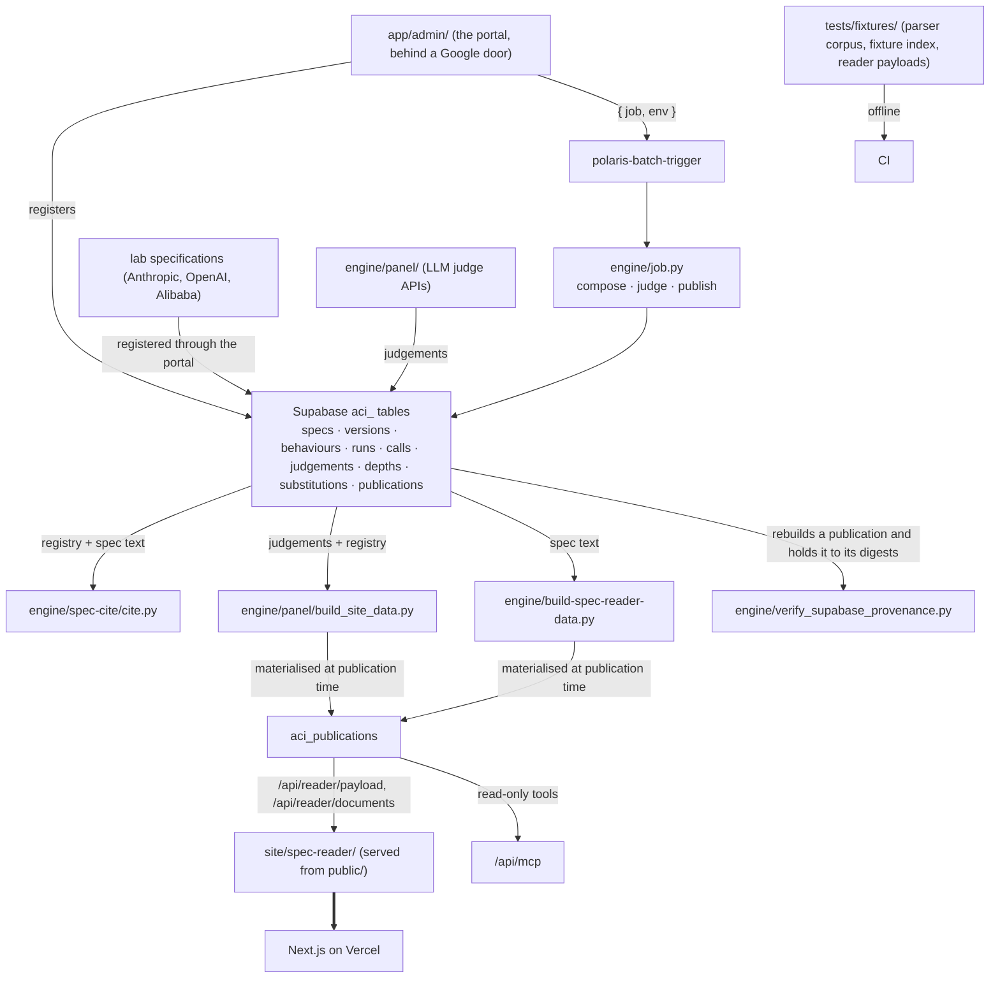

# SYSTEM — global map of the AI Character Index repository

> Current-state doc, plus the branch/local territory documented in `experiments-branches.md`. Describes what exists now, not what should exist. Each directory has its own `OVERVIEW.md`; this file stitches them together.

> **Scope (repo-owner decision):** the deliverable is the **model spec reader only** — behaviour × spec coverage with cited passages. The eval-discovery/quality workflow (sweep stages 1–3, `evals.json`, `sources/`, evidence-strength lens) is outside the deliverable and was deleted by the scope ruling (2026-08-19). This document maps the whole repo as-is; in/out rulings and removal tasks are tracked in [CLOSEOUT-LIST.md](CLOSEOUT-LIST.md).

## What the system is

An index of AI character: **behaviours** (a canonical list) × **model-spec coverage** (cited verdicts against lab specs), published as a Next.js application on Vercel (https://ai-character-index.vercel.app) whose reader routes and public MCP endpoint (`/api/mcp`) read the index out of Supabase, and operated from an admin portal in the same application. As of September 2026 the public publication, `1919ee6b-8a81-4ab5-902a-e949857db028`, carries 13 behaviours over 4 documents (Claude's Constitution 2026-01-20, the OpenAI Model Spec 2025-12-18 and 2026-08-18, and the Alibaba Model Spec 2026-04-00, read in an English machine translation), judged by the `frontier_fast` panel under rubric v5.

**The database is the only source.** git is not the gate and not a copy: the behaviours, the spec text, the judgements and the two payloads the routes serve all live in the `aci_` tables of the shared `evals` Supabase project, and a publication row decides what the reader shows. The tables' migrations live in the `polaris-supabase` repository; this application reads and writes them and never migrates them. What the repository holds is code and fixtures.

Two consequences follow, both deliberate. The clone-and-fork pathway is gone: someone without credentials cannot register a spec or publish, and the upstream repository `AndresCotton/ai-character-index` keeps that property. Judging survives it: `engine/local_run.py` judges a document with one key and no database. And CI knows no secret: it verifies the code against fixtures, while `verify_supabase_provenance.py` verifies the published data when a publication is built, where the credentials already are.

## Global dependency map

## Component catalogue

| Directory | One-line role | Detail |
|---|---|---|
| `.claude/skills/` | Retired procedure layer: no live skills; index files record the retirement (root `AGENTS.md` points here) | [.claude/skills/OVERVIEW.md](.claude/skills/OVERVIEW.md) |
| `engine/` | Automation: citation resolution, LLM panel judging, payload builders, the job the container runs, E2E + feature-harness verifiers | [engine/OVERVIEW.md](engine/OVERVIEW.md) |
| `app/` | The Next.js application: the reader's routes, the MCP endpoint, the proposal route, the admin portal, and the libraries they share | [ROOT.md](ROOT.md) |
| `specs/` | The locator grammar and the mirrors' provenance notes; the texts themselves are in the database | [specs/OVERVIEW.md](specs/OVERVIEW.md) |
| `research/` | Canonical behaviour list | [research/OVERVIEW.md](research/OVERVIEW.md) |
| `archive/` | Preserved analytical artifact: the cross-spec strict-reading judgment (self-describing README inside) | — |
| `methodology/` | Depth rubric (the scale of every judge's depth call), the upstream methodology page's copy, method-exploration findings | [methodology/OVERVIEW.md](methodology/OVERVIEW.md) |
| `site/` | The public pages and the reader's source, copied into `public/` at build time | [site/OVERVIEW.md](site/OVERVIEW.md) |
| `.github/` | CI on fixtures, a scheduled provenance job, and the Issues-page contact link | [.github/OVERVIEW.md](.github/OVERVIEW.md) |
| `design/`, `vision/` | Settled-design log (Jul 2026) and the originating brief | [design/OVERVIEW.md](design/OVERVIEW.md), [vision/OVERVIEW.md](vision/OVERVIEW.md) |
| root files | PLAN.md, README.md, and the Next.js application's configuration | [ROOT.md](ROOT.md) |
| branch/local territory | Experiment branches, parked CI work, local-only branches | [experiments-branches.md](experiments-branches.md) |

## System-level contracts (the tissue between components)

1. **Locator grammar** — `specs/CITATION.md` defines the format; `cite.py`
   implements it. Every stored citation depends on byte-exact resolution, and
   `cite.py` registers nothing at import time: a caller installs a registry
   through `use_registry`, from the database (`index_store.install_registry`) or
   from a fixture. Forgetting is a loud error naming the fix, which is the point
   — a silent fall back to files that are no longer there is the failure this
   arrangement exists to remove.
2. **Behaviour identity** — the slug is the primary key of `aci_behaviours`, the
   only registry. Each row carries the display half (name, group, definition)
   and, where one exists, the judging half whole, in
   `judging`: the definition the panel is given, the boundary of the construct,
   the provenance, and for one behaviour a definition the current rubric prefers.
   The set a row names and its numbering within that set decide nothing any
   more: a publication shows every behaviour it selects. The set column stays
   until the portal's registration route stops writing it. **Defined
   and judged are independent states**: a behaviour is defined once it carries a
   query, and judged once a call for it reaches `done`.
3. **Judging** — a run is a batch of judge calls, one per behaviour × spec
   version × model; a call is the unit of work, cost, failure and resume; a
   judgement is one verdict on one passage. A run freezes what it judged
   against, so it stays replayable after the registry moves on. A document is a
   version, named `<lab>--<document>@<version>`. Judging uses one panel,
   `frontier_fast` (`sol`, `fable`, `deepseek`), under rubric v5, and once a
   cell's passages are in, each judge gives it a 0 to 4 depth in a call of its
   own; a publication carries the mean.
4. **Publication** — a publication selects, cell by cell, which run answers, and
   materialises both payloads the routes serve. Its cells must have been judged
   by exactly the models it names, with the substitutions recorded in
   `aci_seat_substitutions` applied, enforced by a trigger rather than by method
   (`publish.py` also refuses a substitute the panel does not declare for that
   seat in `panel-config.json`). The rule has no exemption: the bench inherited
   from before it, and the `grandfathered` flag that exempted it, were archived by
   the cleanup migration (`polaris-supabase`,
   `20260916090000_aci_cleanup_after_the_one_panel_redesign.sql`).
5. **Provenance** — `verify_supabase_provenance.py` holds one publication to the
   digests it stores, rebuilds it from its own cells, and re-resolves every
   passage it cites against the stored text. It runs as `--publication=<uuid>`
   when a publication is built. The committed payloads the index once shipped
   are recoverable from git history at `085fd2e`.
6. **Serving** — Vercel builds on a push, `prebuild` copies `site/` into
   `public/`, and the reader takes its two payloads from routes. Publishing is
   not a deploy: what the public sees changes with a database write, and the
   write is `is_public` on a publication that already exists.
7. **Proposing** — `/how-it-works` and `/api/submit` are the one door open to
   the internet that writes. A proposal lands in `aci_submissions`, its document
   in the private `aci-submissions` bucket, and a Slack message says so. It
   registers nothing and judges nothing: acting on it costs money, so an operator
   reads it and retypes what they accept into the registration form.
8. **Operating** — every write to the index goes through `app/admin/`, behind
   Google sign-in and an allow-list. The three operations that are Python —
   pricing a run, judging it, building a publication — are launched as modes of
   one Cloud Run job through `polaris-batch-trigger`, or as a local subprocess
   when `ACI_PYTHON` names an interpreter and the environment is not production.
   Each launch is a row in `aci_jobs` carrying where it ran, so a trial on a
   laptop is never mistaken for production work.

## Cross-cutting as-is risks

1. **`cite.py` is the foundation** of every chain and the trickiest code here.
   Its parser is pinned by a corpus dumped from `tests/fixtures/parser-corpus.md`,
   a document written to carry every construction it recognises;
   `tests/test_parser_corpus.py` asserts that coverage construction by
   construction rather than assuming it, which is the only thing that makes a
   synthetic corpus worth anything.
2. **CI verifies the code, not the data.** A regression in what the index
   publishes is caught by the scheduled provenance job rather than on a pull
   request. That is the price of keeping CI offline and secretless.
3. **The judging CLIs lost their smoke tests.** `whole_doc.py` and
   `run_rollout.py` were exercised end to end against a staged file tree, which
   cannot exist now that they read the database. `engine/job.py` supersedes them
   and is tested against a fake store; the two CLIs remain less covered than they
   were, and are no longer the path anything uses.
4. **The portal's checks need credentials.** Its pages read the index on every
   request, so `verify-portal.mjs` cannot run in a secretless CI. It runs where
   the provenance verifier runs. What CI does cover is every library behind the
   pages, with an injected `fetch`.
5. **One publication is exempt** from the homogeneity check, because the bench
   it carries was judged by unequal panels across labs on four behaviours. See
   CLAUDE.md; filling the nine missing calls is dated work, not a side effect.
   It is no longer the public one: as of September 2026 the public publication
   was judged by `frontier_fast` throughout and is not grandfathered.

## Reading order for a cold-start agent

`README.md` → this file → `docs/superpowers/specs/` for why the index moved → `engine/panel/README.md` (panel track) → the `OVERVIEW.md` of the directory being touched.
