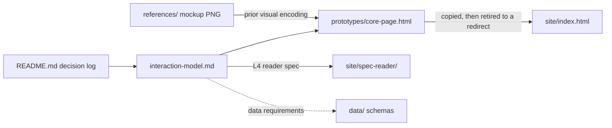

> **A dated archive (as of September 2026).** This overview describes the July 2026 design sprint as the repository stood in August 2026, and has not been brought current since.

# design/ — settled aesthetics decisions, the interaction model, and the core-page prototype

> As-is snapshot of origin/main @ 72e2e6b (2026-08-18), kept current where the site changed under it; the documentation set itself is added by this PR. Describes what exists now, not what should exist.

## Purpose
Where the site's aesthetics and interaction grammar were discussed and settled (the v0 design sprint of 2026-07-12/13). Holds the decision log, the full L0–L4 interaction model, and the working prototype the retired live index was copied from. The live `site/index.html` is now a minimal redirect to `site/spec-reader/`; this directory keeps the prototype as design history.

## Contents
| Path | Holds |
|---|---|
| `README.md` | Dated "Decided" list (2026-07-12 → 2026-07-13): founding-document metaphor, EB Garamond typography, daylight/umber surfaces, dot-run scoring marks, three strata (coverage / instruments / adherence), title-sheet opening; `references/` commentary (AI Lab Watch, METR, Epoch, OWID); a closing `#TODO` for per-spec pages |
| `interaction-model.md` | The depth ladder: L0 title sheet → L1 clauses + two levers (coverage, adherence) → L2 behaviour detail (`/b/<slug>`) → L3 eval breakdown → L4 spec reader (annotated folio, focus highlights, find rail, reading-room modal); interaction rules (hover previews, click commits, back ascends); visual encoding; a "data requirements" section for `data/` schemas |
| `prototypes/core-page.html` | Self-contained ~941-line prototype demonstrating L0–L3 with real behaviour names, definitions, and spec anchors; eval scores labelled as illustrative placeholders; L4 stubbed |
| `references/2026-07-02-index-pipeline-mockup.png` | Screenshot of the v0 HTML mockup's pipeline diagram; established the border = spec coverage, fill = evidence strength encoding |

## Relationships
`site/index.html` served "a snapshot of the design prototype" until the prototype's retirement (2026-08-25); the live page is now a redirect to the reader, and the prototype remains here as history. The L4 spec-reader spec in `interaction-model.md` (focus highlights, passage tints, find rail, split view, reading-room modal) anticipates `site/spec-reader/`, whose `styles.css` carries the same Garamond/registry language. The "data requirements" section asks for additions to `data/coverage.json` (stable anchor ids into the mirrored specs) and `data/evals.json` (per-dimension scores, featured flag, assessment note). `PLAN.md` §1.4 routes "aesthetics discussion → design/ → informs site/", and `vision/features to build.md` is the brief that asked for this folder.

## Dependency map

## As-is observations
- `site/index.html` no longer carries the prototype: it is a minimal redirect to `site/spec-reader/`, so the old divergence hazard (re-copying the prototype would regress live §1 data) is gone; the prototype's only live copy is the one in this directory.
- The decision log records same-day supersessions (constellation map → founding document; "constitutional midnight" → daylight default), so earlier entries are history, not live spec.
- `interaction-model.md` lists the L0 group "Interaction with others (in deliberation)" as current, which does not exist in `research/core-behaviour-list.md` — the design works off a behaviour grouping that lives in Notion, ahead of the repo list.
- The prototype's data is inline in the HTML; it reads nothing from `data/*.json`, so design renders and canonical data are connected only by hand-copying.
- `README.md` ends with an unresolved `#TODO` (a per-spec page with behaviour-select highlighting); `site/spec-reader/` implements that shape (per-spec views + behaviour-select passage highlighting), but the design log does not reference it.
- `references/` holds a single mockup screenshot; the genre reference sites are listed as links only, without screenshots.
