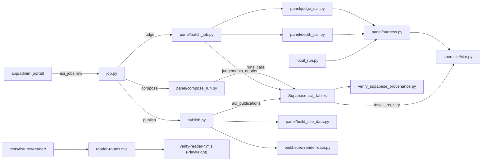

# engine/: the automation layer for citation resolution, LLM panel judging, publication builders and checks

> Current-state doc, as of September 2026: describes what exists now, not what should exist.

## Purpose

Everything that judges the index and builds what it publishes: resolves spec citations, composes and executes judge calls, builds a publication's two payloads, and verifies the reader, the portal and the published data. No component here serves the public directly. Outputs are rows in the `aci_` tables of the `evals` Supabase project; only `local_run.py` writes files, to the gitignored `artefacts/`.

## Contents

| Path | What it is |
|---|---|
| `spec-cite/cite.py` | Locator resolver and verifier (`outline`/`show`/`resolve`/`find`), grammar in `specs/CITATION.md`. Registers nothing at import time: a caller installs a registry through `use_registry`, and the CLI installs the database's. Stdlib only; CLI **and** imported library. Tests: `tests/test_cite.py`, `tests/test_cite_document_source.py`, `tests/test_cite_needs_a_registry.py`, `tests/test_parser_corpus.py`. |
| `spec-watch/pull-latest.sh` | Pre-migration spec puller. No longer runs: it reads `cite.BUNDLED_SPECS`, which no longer exists, and writes into `specs/`, which no longer holds texts. |
| `panel/` | The judging pipeline: `harness.py` (config, registry, passages, prompt composition, verdict parsing), `judge_call.py` and `depth_call.py` (one passage call, one depth call), `compose_run.py` (prices and writes a run's calls), `batch_job.py` (executes them), `bands.py` (the reader's tier bands, held to `app/lib/bands.mjs`), `build_site_data.py` (the behaviour payload), `panel-config.json`, `prompts/`. `whole_doc.py`, `run_rollout.py` and `select_strata.py` are the pre-migration CLIs; `whole_doc.judge_kwargs` still sets every call's parameters. `runlog-v5.md` and `runlog-v3.md` record logs that left the branch. See `panel/README.md`. |
| `job.py` | What the judging image runs: reads its `aci_jobs` row and dispatches on `ACI_JOB_MODE` (`compose`, `judge`, `publish`). |
| `publish.py` | Builds a publication as a draft: holds every cell to the panel with recorded substitutions applied, builds both payloads for the selection, inserts the row. |
| `seat_substitutions.py` | Reads `aci_seat_substitutions`, and states the publication trigger's seating rule for `publish.py` and the builder. |
| `store.py`, `index_store.py` | Stdlib PostgREST client, and the index read back in the shapes the builders expect (`install_registry` among them). |
| `build-spec-reader-data.py` | The documents payload: the text of every version a publication carries. |
| `coverage_payload.py` | Converts a frozen-ledger record into the reader's coverage shape. Nothing imports it any more; `test_coverage_payload.py` still tests it. |
| `local_run.py` | Judges one document against one behaviour with one key and no database; results in `artefacts/`. |
| `verify_supabase_provenance.py` | Checks one publication (the newest public one, or `--publication=<uuid>`): digests, rebuild, boundaries, locators. Needs credentials. |
| `published-artefacts.sha256.json` | Digests of what the index published when the migration was verified, and the commit (`085fd2e`) its source files are recoverable from. |
| `verify-reader-test.mjs`, `verify-reader-features.mjs`, `reader-routes.mjs` | The two reader walkers (need Chrome). `reader-routes.mjs` answers the reader's routes from `tests/fixtures/reader/`, a current and a draft publication. |
| `verify-portal.mjs` | Read-only walk through the admin portal against a running server. Needs credentials, so no workflow runs it. |
| `notion-sync/` | Empty placeholder (`.gitkeep`). |

## Relationships

- `cite.py` is the shared foundation: `harness.passages` segments a document through it, and `index_store.install_registry` feeds it the stored text of `aci_spec_versions`.
- The judging chain: the portal writes an `aci_jobs` row and starts `job.py`; `compose_run.py` writes a run's calls; `batch_job.py` executes them through `judge_call.py`, then `depth_call.py`, writing `aci_judgements` and `aci_depths`.
- The publication chain: `publish.py` selects cells, `build_site_data.py` and `build-spec-reader-data.py` build the two payloads for them, and one insert writes `aci_publications`, not public until an operator says so.
- `verify_supabase_provenance.py` rebuilds a publication with the same builders and holds the stored bytes to their digests.
- `local_run.py` uses the same composer, parser and prompt as the job, against a file instead of the database.

## Dependency map

## As-is observations

- No Python package structure: no `__init__.py`/`pyproject.toml`; all cross-module wiring is `importlib` file-loading and `sys.path` inserts. Renames and moves break only at runtime.
- `cite.py` is the foundation of every chain and the trickiest code in the repo; its parser is pinned by `tests/test_cite.py` and the corpus in `tests/fixtures/parser-corpus.md` (goldens in `tests/golden/`).
- Config loads lazily at use time and is injectable (`harness.load_config()`); `TestImportSideEffects` in `test_panel.py` pins that no panel module reads files at import.
- Locators are stored with `" > "`; `cite.py` also accepts the grammar's display separator `" › "`.
- `display.threshold` and `display.solid_threshold` still shape the behaviour payload, but the reader recomputes its bands from each passage's verdicts, so the baked `adjacent` flag is vestigial (see `display._comment` in `panel-config.json`).
- The pre-migration CLIs still read and write runlog files nothing else uses, and are no longer the path anything takes; `run_rollout.py` ends by suggesting a `build_site_data.py --runlog=` rebuild, which the builder now refuses.
- `.github/workflows/ci.yml` runs the offline suites and the two reader walkers on every PR. It does not run `test_seat_substitutions.py`, `test_coverage_payload.py`, `panel/test_appjs_locator.js`, `panel/test_appjs_opening.js`, `panel/test_appjs_translation.js` or `panel/test_reader_v5_labels.js`.
- Hygiene: `__pycache__/` and `*.pyc` are gitignored; `wholedoc-FAILED-*.txt` outputs are still not.
