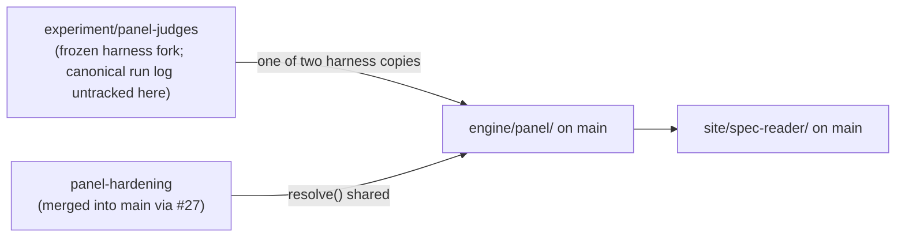

# Experiment branches & local-only territory — what exists outside origin/main

> As-is snapshot of the working copy and branch list (main @ 72e2e6b). Describes what exists now, not what should exist. This document covers satellite territory only; `SYSTEM.md` covers main itself.
> **Staleness warning:** this inventory is a dated snapshot of one working copy; it silently rots as local branches are deleted or merged, and several entries below have pending deletion rulings on the closeout list. Verify against the live repo before acting on any entry.
> **Since then (September 2026):** the published data no longer depends on any working copy. The index lives in Supabase. The branch inventory below has not been re-checked.

## Purpose

Alignment and planning conversations need the full inventory, not just main. This maps everything that lives on experiment branches or only in the local working copy — including the provenance of main's published panel data, which depends on an UNTRACKED FILE in one local working copy (committed to no branch).

## Contents

### `experiment/panel-judges` (branch; PR #16 — draft, explicitly review-only, not for merge)

- `experiments/panel-judges/` (60 tracked files): a **self-contained experiment** with its own frozen harness fork (`harness.py`, `batch_panel.py`, `cost.py`, `panel-config.json`, `behaviours.json`), collection/audit tooling (`aggregate.py`, `score_audit.py`, `select_contested.py`, `build_panel_data.py`, `export_coverage.py`), prompt templates v2/v3, run logs (`runlog.jsonl`, `-v2`, `-v2b`, `-smoke`), per-model score JSONs, and `calib/` rounds including `*-FROZEN` markers.
- Human audit materials: `audit-sheet.md`, `audit-sheet-shared20.md`, `audit-labels-matt.json`, `audit-labels-andres.json`, `audit-key.json`; results in `FINDINGS.md`.
- Untracked locally: whole-doc reports (`WHOLEDOC-REPORT.md`, `WHOLEDOC-SPOTCHECK.md`, `SMOKE-SPOTCHECK.md`, `THRESHOLD-TABLE.md`), probe scripts/outputs, run logs v3/v3smoke/smoke3, debug dumps.
- One of the two copies of the panel harness (the other is `engine/panel/` on main); this copy is frozen for experiment reproducibility. The canonical run log that main's shipped panel data points to lives here ONLY AS AN UNTRACKED FILE (see the untracked-locally line above) — committed to NO branch, this one included; deleting the branch is irrelevant to it, but losing this working copy loses it.

### `experiment/semantic-coverage` (branch; reference archive — its PR is closed unmerged, branch kept)

- Whole-doc mode on the head-to-head harness; result: **negative at ~600 passages**.
- Untracked locally in this worktree: score JSONs, HTML viewers, `ckpts/` (3.3 GB HuggingFace cache of `lytang/MiniCheck-DeBERTa-v3-Large` — re-downloadable, never pushed to GitHub).

### Panel-line branches

- `panel-hardening` is fully merged into main (PR #27: rubric calibration v4a/v5/v5.1, the `frontier_fast` calibration panel, the full v5 bench); it stays as a merged ref only. The calibration rubric texts are the prompt files in `experiments/panel-calibration/prompts/` (v3w/v4a/v5/v5.1) carried by runlog keys — the frozen rubrics in `engine/panel/harness.py` remain v1/v2/v3.
- `panel-frontier-coverage`, `panel-pipeline-rollout`, `panel-stage4-docs`, `panel-stage4-replacement` do not exist as branches; their content is in main.
- Provenance dependency: the canonical run log exists only as an untracked file in the `experiment/panel-judges` working copy (above) — committed to no branch. Losing that working copy loses the shipped panel dataset's only reproduction trail; committing the log is an open closeout item.

### Local-only branches (never pushed)

| Branch | What it is |
|---|---|
| `backup/pre-final`, `backup/pre-linearize` | Safety snapshots of pre-linearization history; orphaned by design, deletion irreversible. |
| `tests/cite-suite`, `ci/fast-suite`, `hooks/fast-gate` | One cluster: the `cite.py` regression suite (~10,600 lines: tests + goldens + `dump_goldens.py`) plus a draft PR-time CI workflow and a pre-commit fast-gate experiment. Same suite as on `feat/cite-sweep`. |

### Other unmerged/untracked items

- `feat/cite-sweep`: the term-sweep stage 4 this branch implements is not the operative procedure (the LLM panel is); kept as the **only remote custodian of the cite.py regression suite**. That TBD is now resolved — the Phase-2 stack committed the suite into its `tests/` (`test_cite.py`, `test_cite_user_specs.py`, the corpus goldens, and `dump_goldens.py`), so once the stack merges into main the suite's permanent home is `tests/` and this branch's custodial role ends. (This worktree's own `tests/` is still empty — the suite lives on the stack, not here.)
- `research/sweeps/04-instruction-hierarchy/` — untracked working record; the tracked `research/sweeps/` home is retired with the publish path, so this record has nowhere to land.
- `docs/semantic-tagging-demo.md` — untracked working-copy file (semantic-tagging demo); belongs to no branch.
- `tests/` in this worktree — empty except bytecode.
- `experiments/panel-judges/.gitignore` is deliberately permissive: run logs and score JSONs are tracked ("that's the data").

## As-is observations

- Two panel-harness copies exist (`engine/panel/` on main, `experiments/panel-judges/` here) and diverge intentionally — experiment instrumentation must not drift — but the convention is nowhere documented; an agent might "helpfully" try to deduplicate them.
- Published-data provenance depends on one working copy: the canonical run log is an untracked file in the `experiment/panel-judges` working copy (committed to no branch), so the loss event is losing that working copy — branch deletion is irrelevant to it. Committing the log is an open closeout item.
- The experiment's analysis artifacts (whole-doc reports, threshold tables, probe outputs) are untracked: the experiment's conclusions currently live only in this working copy.
- Local disk footprint is dominated by re-downloadable caches (`ckpts/`); actual experiment data is ~24 MB.
- The test-infrastructure cluster is partly placed: the cite suite has a home (the Phase-2 stack's `tests/`, which merges into main), while the CI workflow + hook experiments still have no decided home — that remainder is the subject of an open architecture decision, not debris.
