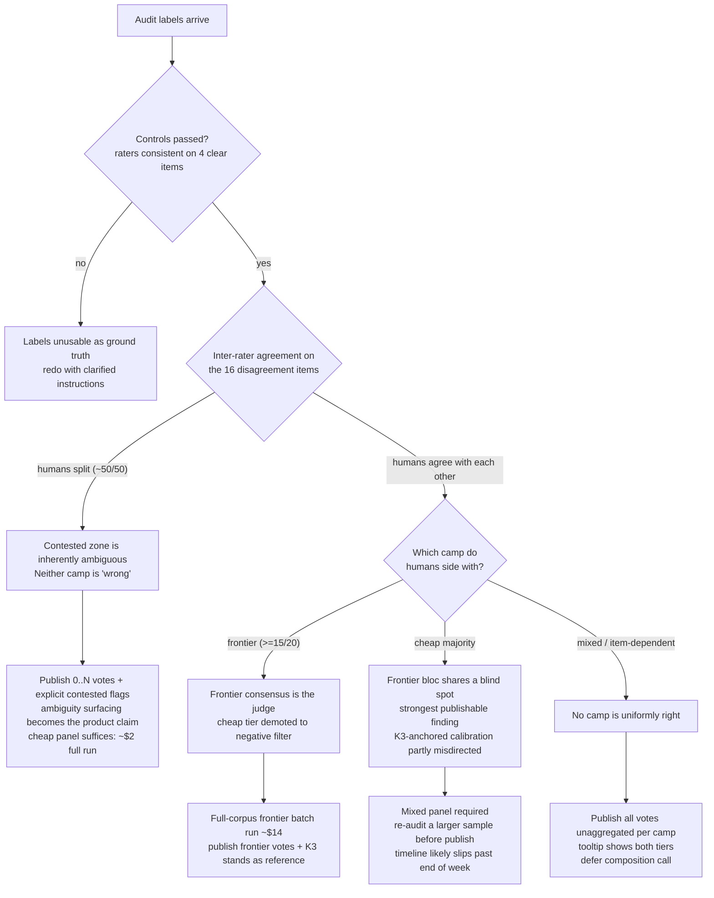

# Findings: lexical → semantic → panel of judges

**Lexical Approach**
*What*: We used an LLM to generate plausibly concept-related terms, then deterministically filtered spec sections for those terms as candidate matches. A second LLM pass curated the candidates for actual relevance, since the irrelevant hit rate was too high to filter by hand.

*Why we dropped it*: The best case for the lexical approach didn't meet our goals to provide (1) high quality and (2) human interpretable/auditable linkage between behaviors and parts of the spec. Neither of these were met:

1. **Quality:** the lexical approach, by definition, doesn't select on meaning, so any lexical pre-filter silently discards passages that are semantically relevant but share no vocabulary with our term set. The dropped linkages aren't visible with this approach, so we'd need one of the approaches below to resolve it regardless.
2. **Interpretability/Auditability**: An LLM is still responsible for (a) defining the set of lexical terms that are relevant for a given behavior and (b) curating whether the lexically matched item was relevant. The only deterministic piece was the filtering itself, which the LLM was already using as an ad hoc tool.

-----

**Semantic Embedding Approach**
*What*: We used Qwen3-Embedding-8B and text-embedding-3-small embedding encoders to produce concept vectors for each behavior and each paragraph + sentence of each character spec, then used cosine similarity to determine relevance between the behavior and the spec section. We additionally experimented with adding extra language into the behavior spec to attempt to get better matches (the best of which is represented below as +expand). Finally we used MiniCheck-deberta to directly measure the groundedness of each behavior in each spec section. To verify the quality of each approach we compared them to a per-section relevance score provided by Kimi K3 on which we performed a high level quality review. In general, paragraph-level matching was less noisy, so we restrict our results to that. We used both a well defined behavior and a broad behavior to evaluate the results across the OpenAI and Anthropic specs.

*Results* (paragraph-level; scored against a per-passage Kimi-K3 relevance reference)

**Well-defined behaviour** — no-sycophancy, scored across both specs combined (589 OpenAI model-spec ¶ + 374 Anthropic constitution ¶ = 963 passages; 41 relevant per K3)

| Approach | Spearman | AUC | iso-RMSE / K3σ | best F1 @ thr |
|---|---:|---:|---|---|
| MiniCheck-deberta | 0.20 | 0.78 | 0.15 / 0.16 | 0.23 @ 0.20 |
| Qwen3-Embedding-8B +expand | 0.37 | 0.76 | 0.15 / 0.16 | 0.27 @ 0.64 |
| Qwen3-Embedding-8B | 0.29 | 0.69 | 0.15 / 0.16 | 0.19 @ 0.65 |
| text-embedding-3-small +expand | 0.47 | 0.77 | 0.15 / 0.16 | 0.20 @ 0.46 |
| text-embedding-3-small | 0.39 | 0.72 | 0.15 / 0.16 | 0.19 @ 0.40 |

**Broadly-defined behaviour** — undermine-oversight, scored across the same combined corpus (963 passages; 54 relevant per K3)

| Approach | Spearman | AUC | iso-RMSE / K3σ | best F1 @ thr |
|---|---:|---:|---|---|
| MiniCheck-deberta | 0.29 | 0.83 | 0.15 / 0.18 | 0.44 @ 0.07 |
| Qwen3-Embedding-8B +expand | 0.62 | 0.91 | 0.13 / 0.18 | 0.47 @ 0.50 |
| Qwen3-Embedding-8B | 0.57 | 0.89 | 0.14 / 0.18 | 0.46 @ 0.62 |
| text-embedding-3-small +expand | 0.61 | 0.89 | 0.14 / 0.18 | 0.48 @ 0.47 |
| text-embedding-3-small | 0.56 | 0.89 | 0.14 / 0.18 | 0.39 @ 0.40 |

*Column legend.* **Spearman** -- rank correlation of the approach's similarity score with the K3 reference score. **AUC** -- probability the approach ranks a K3-relevant passage above an irrelevant one. **iso-RMSE / K3σ** -- error of the best monotonic (isotonic) fit from similarity to K3 score, shown against the standard deviation of the K3 scores; iso-RMSE ≈ K3σ means the fit barely beats predicting the mean, i.e. no usable *value* calibration. **best F1 @ thr** -- the best relevant/not F1 achievable by any single similarity threshold, and the threshold that achieves it.

*Interpretation*: Assuming K3 results as a golden with relevance cutoff of >= K3's 0.5 score, the best expansion we tried tops out at roughly F1 0.27 on the well-defined behavior and F1 0.48 on the broad one. Note that this assumes an ideal function you could apply to the raw similarity score to get it as close as possible to the K3 decision, so the numbers give the semantic vector approach the best reading we can. We used F1 over accuracy because only about 4 in every 100 passages are actually relevant, so a lazy system that labels everything "not relevant" is accurate 96% of the time and has 0 value. We asked:

1. Ranking (AUC): *If you sort every passage by its score, do the genuinely relevant ones rise toward the top?* (Mostly) **yes**. If you pick one relevant and one irrelevant passage at random, the relevant one gets the higher score about 77% of the time for the well-defined behavior and 91% for the broad one.
2. Drawing the line (best F1 & calibration): *Can you draw a single score cut-off that cleanly splits relevant from not-relevant or read the score itself as "how relevant" a passage is?* **No.** Even handed the most generous cut-off we could pick, the best split still gets most of what it flags wrong (best F1 only 0.27 for the well-defined behavior, 0.48 for the broad one). And the score doesn't behave like a dial you can trust: fit the best possible curve from similarity to the K3 relevance value and it barely beats throwing the score away and guessing the average for everything (iso-RMSE ≈ K3σ). So the score tells you roughly where a passage sits in the stack, but not whether it clears the bar.

*Why we dropped it*: We did see considerable improvement from expanding the base behaviors, but even so getting high enough quality results required per-behavior iteration. There was no clear indication during optimization how far you were from quality results -- e.g. whether your optimization was correctly including all semantically relevant content or just refining the set of already selected content. It's possible we could have come up with an LLM-automatible procedure to optimizing behavior language in a spec-generalizable way that would result in high quality concept vectors and correct behavior spec linkage with light human auditing. However, the cost of getting to that point looks high and highly spec/behavior specific. This could be considered for a future iteration but isn't currently making sufficient progress towards discovering the product market fit of this tool, and so was dropped for the more promising panel of LLM judges approach.

-----

**Panel of LLM Judges**
*What*: Rather than one similarity score or one judge, each spec passage is put to a panel of LLM judges, each returning a binary relevant/not verdict under one uniform prompt. The published score is 0..N -- the number of judges that voted relevant -- so agreement across the panel is visible on every passage.

*Why we moved here*: The semantic results above were all validated against a single strong judge (Kimi-K3), and that judge's signal looked clean and on-target. However, choosing an LLM means we have to accept the biases of that LLM. We are currently evaluating the extent to which we can overcome that bias by using a panel vs the extent to which cross-model correlated biases still persist for this task. Our hope is that a panel makes both per-model bias and uncertainty observable: where judges agree we have a trustworthy label, and where they split we have a flag for human review rather than a false-confident score.

*Setup*: One uniform system prompt (binary relevant/not, verdict-per-line, ~40 passages per call) across every model via OpenAI-compatible endpoints. Cheap tier: gpt-5-mini (OpenAI), Haiku 4.5 (Anthropic), Qwen3-32B (Chinese OSS). Frontier tier: GPT-5.6 Sol, Fable 5, with Kimi-K3 reused as the Chinese frontier vote. All verdicts append to a durable runlog (resume skips completed work); per-call latency and tokens are logged, so every cost below is measured, not estimated. Format held everywhere: ~100% parse across all five families (one 1.2% blip from Qwen in one early run).

*Result 1 -- the rubric needs calibrating, and two rounds were enough*: Out of the box the three cheap models had wildly different bars for "relevant" (80% / 32% / 70% of passages flagged). Tightening the prompt (govern-the-specific-behaviour test, explicit topical-adjacency exclusion, when-unsure-0) fixed the gross miscalibration in two rounds, measured against K3's binary labels on no-sycophancy (963 passages, 41 relevant per K3):

| round | gpt-5-mini P/R/F1 | Haiku P/R/F1 | Qwen-32B P/R/F1 | inter-model agree |
|---|---|---|---|---|
| initial rubric | .13/.88/.23 | .18/.76/.30 | .16/.66/.26 | 77-83% |
| tightened rubric | .22/.88/.35 | .40/.59/.48 | .22/.73/.34 | 85-88% |

*Result 2 -- the rubric generalizes across behaviours with zero re-tuning*: We froze the prompt after calibrating on no-sycophancy and ran undermine-oversight untouched. Nothing degraded -- F1-vs-K3 actually improved (.36/.49/.52), and the vote-count correlation with K3 held (Spearman 0.52 -> 0.50). This is the single most important contrast with the semantic approach, which required per-behaviour hand-tuning with no convergence signal.

*Result 3 -- the 0..N vote count is a meaningful graded score*: Binary F1 against a thresholded K3 undersells the panel (it double-thresholds two graded signals). The panel's native output -- how many models voted relevant -- tracks K3's *continuous* score monotonically on both behaviours:

| panel votes | mean K3 (no-syc) | n | mean K3 (undermine) | n |
|---|---|---|---|---|
| 0 of 3 | 0.04 | 733 | 0.07 | 793 |
| 1 of 3 | 0.13 | 134 | 0.22 | 106 |
| 2 of 3 | 0.26 | 60 | 0.33 | 42 |
| 3 of 3 | 0.58 | 36 | 0.76 | 22 |

The hardest version of this claim we can currently defend: **a passage no model flags is reliably irrelevant** (mean K3 ~0.05 over 1,500+ passages) -- a trustworthy negative filter the embeddings never gave us. The 1-2 vote middle is the contested zone (~15-20% of the corpus), which is either the human-review feature or the scaling problem, pending the audit below.

*Result 4 -- the frontier models vote as a bloc; the cheap models scatter*: We ran the frontier pair on just the contested passages (cheap panel split, or unanimous against K3). Two findings. First, on exactly the passages the cheap tier couldn't resolve, the frontier models side heavily with K3:

| model | agree-K3 (no-syc / undermine) | F1 vs K3 |
|---|---|---|
| gpt-5-mini | 36% / 21% | .16 / .21 |
| Haiku 4.5 | 75% / 66% | .04 / .22 |
| Qwen3-32B | 45% / 68% | .11 / .26 |
| **GPT-5.6 Sol** | **89% / 75%** | .48 / .43 |
| **Fable 5** | **92% / 82%** | .38 / .29 |

Second, the camps have opposite internal structure on these items: frontier pairwise agreement is 75-92% (and this was not selected for -- the contested set was built from cheap votes alone), while cheap pairwise agreement is 21-66%. On a 13-passage probe where the cheap panel was *unanimous* against K3, Sol sided with K3 10/13 and Fable 11/13. This is the fork the whole approach now sits on: either the frontier bloc is genuinely better on hard cases, or frontier models (including K3 -- and including the model drafting this document) share correlated blind spots and the cheap models' scatter contains corrective signal. Agreement data cannot distinguish these. Only human labels can.

*Result 5 -- corrected definitions + a 3-point scale (the v2 rubric)*: Scaling to the nine publishable behaviours exposed a construct-boundary problem: sibling behaviours that share vocabulary bled into each other (harmlessness-to-the-user vs harm-to-third-parties overlapped at Jaccard 0.47 on majority votes), traceable to our queries carrying only the one-line definitions while the source sweeps' scope notes -- which draw exactly these boundaries -- were dropped. A fresh-eyes review of the prompts also caught three validity bugs (resume ignored rubric version; unparsed verdicts silently counted as "not relevant"; the generic rubric told judges to zero passages about "general helpfulness", contradicting the helpfulness behaviour itself). v2 therefore: appends each behaviour's boundary clause from its own scope note, fixes all three bugs, adds section context to every passage, and switches the verdict to a 3-point scale -- 2 core / 1 adjacent / 0 neither -- so borderline material has a home instead of forcing a coin flip (this also matches the site's Core/Related vocabulary and our human raters' 1.0/0.4/0.0 labels; binary is always derivable as core-only).

v2 results: on the K3-referenced behaviours the ternary core verdicts held or improved (no-sycophancy F1 .31-.50 vs v1 .34-.48; undermine-oversight .58-.61 vs .36-.49 on the constitution half). On the sibling overlap, a split verdict that we now believe is the correct answer rather than a failure: the vocabulary-driven confusion collapsed (helpfulness vs harmlessness 0.24 -> 0.14; helpfulness vs third-party 0.11 -> 0.06) while the harm pair barely moved (0.47 -> 0.44) -- and reading the 133 passages both harm rows still claim (hard constraints, hateful-content rules, privacy, "beneficial to the world"), they genuinely govern harm to whoever it lands on. The curation avoids overlap by assigning each passage one editorial "home"; the panel answers per-behaviour relevance, and for audience-neutral harm rules the honest answer is "both". Shared substance is a property of the spec, not a bug in the judge. Curated-core recovery held throughout (23-25 of 25-30 per behaviour at core; 28-30 counting adjacent).

*The audit -- RESULT*: Two raters independently labeled the blinded shared-20 sheet (16 strongest camp-disagreements + 4 controls; 1.0/0.4/0.0 = core/adjacent/neither; model votes hidden; scored by `score_audit.py`). Validity held: 7/8 control passes, inter-rater agreement 16/20 on the strict binarization (0.4->0, the mapping the first rater himself prescribed). The verdict:

- **Strict (core) bar: the frontier camp is vindicated.** Each rater sided with the frontier consensus on 12-13 of the 16 camp-disagreements; on the 13 items where the raters agree, frontier was right **11/13** (binomial p ~ 0.011 vs coin-flip). The cheap majority's disagreements with the frontier bloc were not corrective signal about core relevance.
- **Lenient bar (0.4->1): a coin flip** (4/10 consensus items). Both raters used "adjacent" heavily (8-9 of 20). Together the two mappings say the cheap panel's extra flags were mostly capturing genuinely *adjacent* material -- not noise, but not core -- while the frontier trio is correct at the core bar. Neither original hypothesis ("shared frontier blind spot" vs "cheap = noise") survives cleanly; the truth is a precision/recall split, which the v2 ternary rubric and a core-vs-core+adjacent "precision/recall mode" UI toggle both encode directly.

Caveats: n=13 consensus items; both raters judged passages without full-document context; the audited cheap votes were v1-rubric (pre-calibration); and K3 sits inside the winning camp, so this result also re-legitimizes K3 as a reference. Decisions taken: published *core* calls should be frontier-anchored on contested passages; the cheap tier is re-roled (trustworthy unanimous-negative filter + cheap adjacent-band approximation) rather than dropped; remaining frontier spend targets the v2-derived contested set of the nine publishable behaviours (~$4-7).

*Cost (measured)*: cheap panel ~$0.18 per behaviour for all 3 models (963 passages, reason off); frontier pair on contested-only, 2 behaviours: $1.61 actual vs $0.79-1.13 predicted (contested passages run long; Fable's output is ~2.3x Sol's). Projections from measured token rates: all 9 publishable behaviours = ~$2 (cheap, live), ~$14 (frontier pair, full corpus, batch), ~$7 (frontier pair, contested-only, live). Iteration is not cost-bound; one full calibration round on a behaviour costs cents.

*Status now*: v1 (binary, definition-only) collection COMPLETE for all 9 publishable behaviours and live in the reader-test site overlay (behaviour-hue outlines + vote chips + tooltips + agreement slider + rail marks, branch-only). v2 (ternary + scope clauses) collection COMPLETE for all 11 behaviours (31,779 verdicts, 0 unparsed) and now live in the demo (core votes; the adjacent band is collected but not yet surfaced in the UI). Audit sheets distributed, labels expected tomorrow morning. Total spend to date $6.33 across all experiments (exact, from logged token counts).

*Next steps -- decision tree on the audit result*:

Under every branch except cheap-majority, the end-of-week publish holds: the cheap 9-behaviour data lands tonight, the UI is wired, and the frontier batch (if needed) fits inside a Thursday submit -> Friday aggregate window.