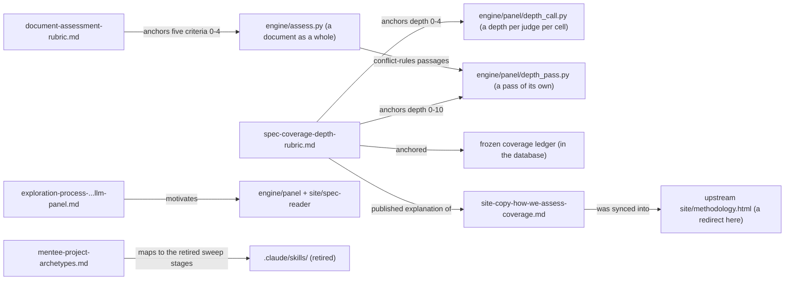

# methodology/: the two rubrics, the method's former site copy, and exploratory method write-ups

> Current-state doc: describes what exists now, not what should exist. First written as a snapshot of origin/main @ 72e2e6b (2026-08-18); brought current in September 2026.

## Purpose
The methodological backbone for the coverage side of the index: the rubric that anchors every depth score, on both the scale of four and the scale of ten; the rubric that anchors the assessment of a document as a whole; the public-facing copy that explained how coverage was assessed; and two exploratory/forward-looking documents (the lexical→semantic→panel method exploration, and mentee project archetypes).

## Contents
| Path | Holds |
|---|---|
| `spec-coverage-depth-rubric.md` | The canonical depth rubric, carrying both scales. The scale of ten, as of September 2026: 6-level anchor table on the even numbers (0 absent / 2 named / 4 discussed / 6 prescribed / 8 demonstrated / 10 bounded), the three conditions for 10 (an edge shown, a conflict settled, a default for the undecidable case, each holding for every facet the behaviour's brief names), what an odd number means, boundary tests (4v6 grading test, 6v8 worked-example test, 8v10 borderline test, "dedicated section is evidence not requirement", "independent of authority level"), and the two blocks a judge is shown. Below it the scale of four, what every publication so far was given on: 5-level anchor table (0 absent / 1 named / 2 discussed / 3 prescribed / 4 demonstrated), its own boundary tests, and a precedent table re-checking all six behaviour-1/2/3 scores |
| `document-assessment-rubric.md` | The canonical rubric for a document as a whole: five criteria scored 0 to 4 with their 0, 2 and 4 anchors (conflict rules, unresolved contradictions, force of each rule, reasons given, situations covered), the six situations the fifth checks, what counts as a contradiction and how one is found, pooled, read and settled under the second method of 22 September 2026, and how the total out of 20 is made |
| `site-copy-how-we-assess-coverage.md` | Working copy of the "How we assess coverage" section of the upstream methodology page; explains pinned verbatim citations, the term-sweep method, core/related passages, and a worked no-sycophancy example deriving the depth scores published then. As of September 2026 no page of this site carries it: `site/methodology.html` redirects to `/how-it-works` |
| `exploration-process-lexical-semantic-llm-panel.md` | Findings doc comparing three passage-linkage methods (lexical filtering, semantic embeddings with metric tables, panel of LLM judges) and why lexical and embedding approaches were dropped in favour of the panel |
| `mentee-project-archetypes.md` | Provisional (2026-07-21) shape of mentee/SPAR contributions on the evidence layer: four archetypes (A1 audit, A2 reproduction, A3 convergent validity, A4 new-facet eval) plus a per-behaviour suitability map for behaviours 1–13 |

## Relationships
`spec-coverage-depth-rubric.md` anchors the depth each judge of the panel gives per behaviour per document; a publication carries the mean, and says which scale it was built on. The scale of four is given in its own call inside the judging job (`engine/panel/depth_call.py`, whose prompt `engine/panel/prompts/depth-v1.txt` restates the scale and its boundary tests). The scale of ten is given in a pass of its own (`engine/panel/depth_pass.py`, prompt `engine/panel/prompts/depth-v2.txt`), because a judge on that scale is also shown the passages stating the document's general rules for conflicts, which come from an assessment of that document. `document-assessment-rubric.md` anchors that assessment (`engine/assess.py`, prompts `assessment-criteria-v1.txt`, `assessment-contradictions-v2.txt` and `assessment-confirm-v2.txt`), and its first criterion is what supplies those passages, so the two rubrics are read in that order. It was also the source of the depth values in the frozen coverage ledger, which left `data/coverage.json` for the database, and is cited by the preserved strict-reading judgment in `archive/general-welfare-strict-reading/`. `site-copy-how-we-assess-coverage.md` was synced into the upstream `site/methodology.html`; here that page is a redirect, so the copy is a record with no downstream consumer. The exploration doc motivates the panel approach implemented in `engine/panel/` and surfaced via `site/spec-reader/`. `mentee-project-archetypes.md` maps onto the since-retired sweep pipeline (A1 = the evidence-discovery stages) and the behaviour list in `research/core-behaviour-list.md`.

## Dependency map

## As-is observations
- The rubrics' canonical locations are `methodology/spec-coverage-depth-rubric.md` and `methodology/document-assessment-rubric.md`. Every prompt restates them rather than reading them, so a change of substance to a rubric has to land in its prompt too, and the changed prompt carries a new digest on the runs that use it. There are four such prompts now: `depth-v1.txt` and `depth-v2.txt` for the two depth scales, and `assessment-criteria-v1.txt` with `assessment-contradictions-v2.txt` and `assessment-confirm-v2.txt` for the assessment.
- No publication carries a depth out of ten or an assessment as of 22 September 2026. Both rubrics describe what has been run and stored, not what the site shows.
- `PLAN.md` §8's repo map does not list `methodology/` as a top-level directory (the root `README.md` map does).
- `mentee-project-archetypes.md` is self-declared provisional and notes "the repo copy of `core-behaviour-list.md` predates the 'Interaction with others' group and is stale for rows 11–13" — its behaviour numbering anticipates a list newer than the one committed.
- The exploration doc and mentee doc are forward-looking/decision records, not consumed by any build or render step. Only the depth rubric has a live downstream consumer, through the depth prompt; the site copy lost its page.
- The site copy references the upstream URL (`ai-character-index.pages.dev/methodology`) and states the full per-behaviour reports "will be published in the following weeks": a publication-status claim of that time, which the note at its head now marks as a record.
