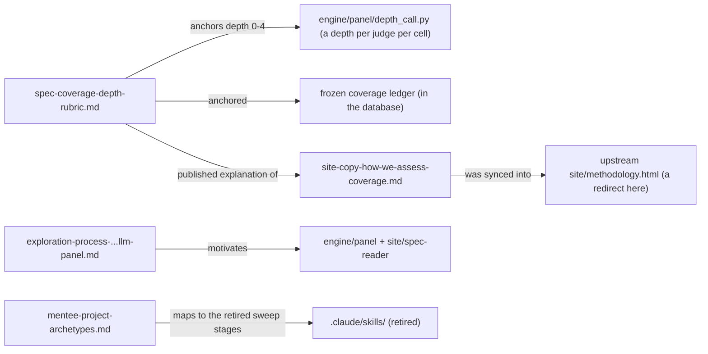

# methodology/: the depth rubric, the method's former site copy, and exploratory method write-ups

> Current-state doc: describes what exists now, not what should exist. First written as a snapshot of origin/main @ 72e2e6b (2026-08-18); brought current in September 2026.

## Purpose
The methodological backbone for the coverage side of the index: the rubric that anchors every 0–4 depth score, the public-facing copy that explained how coverage was assessed, and two exploratory/forward-looking documents (the lexical→semantic→panel method exploration, and mentee project archetypes).

## Contents
| Path | Holds |
|---|---|
| `spec-coverage-depth-rubric.md` | The canonical depth rubric: 5-level anchor table (0 absent / 1 named / 2 discussed / 3 prescribed / 4 demonstrated), boundary tests (2v3 grading test, 3v4 worked-example test, "dedicated section is evidence not requirement", "scored on core excerpts", "independent of authority level"), and a precedent table re-checking all six behaviour-1/2/3 scores |
| `site-copy-how-we-assess-coverage.md` | Working copy of the "How we assess coverage" section of the upstream methodology page; explains pinned verbatim citations, the term-sweep method, core/related passages, and a worked no-sycophancy example deriving the depth scores published then. As of September 2026 no page of this site carries it: `site/methodology.html` redirects to `/how-it-works` |
| `exploration-process-lexical-semantic-llm-panel.md` | Findings doc comparing three passage-linkage methods (lexical filtering, semantic embeddings with metric tables, panel of LLM judges) and why lexical and embedding approaches were dropped in favour of the panel |
| `mentee-project-archetypes.md` | Provisional (2026-07-21) shape of mentee/SPAR contributions on the evidence layer: four archetypes (A1 audit, A2 reproduction, A3 convergent validity, A4 new-facet eval) plus a per-behaviour suitability map for behaviours 1–13 |

## Relationships
`spec-coverage-depth-rubric.md` anchors the 0 to 4 depth each judge of the panel gives per behaviour per document in its own call (`engine/panel/depth_call.py`, whose prompt `engine/panel/prompts/depth-v1.txt` restates the scale and its boundary tests); a publication carries the mean. It was also the source of the depth values in the frozen coverage ledger, which left `data/coverage.json` for the database, and is cited by the preserved strict-reading judgment in `archive/general-welfare-strict-reading/`. `site-copy-how-we-assess-coverage.md` was synced into the upstream `site/methodology.html`; here that page is a redirect, so the copy is a record with no downstream consumer. The exploration doc motivates the panel approach implemented in `engine/panel/` and surfaced via `site/spec-reader/`. `mentee-project-archetypes.md` maps onto the since-retired sweep pipeline (A1 = the evidence-discovery stages) and the behaviour list in `research/core-behaviour-list.md`.

## Dependency map

## As-is observations
- The rubric's canonical location is `methodology/spec-coverage-depth-rubric.md`. The depth prompt restates it rather than reading it, so a change of substance to the rubric has to land in `engine/panel/prompts/depth-v1.txt` too, and the changed prompt carries a new digest on the runs that use it.
- `PLAN.md` §8's repo map does not list `methodology/` as a top-level directory (the root `README.md` map does).
- `mentee-project-archetypes.md` is self-declared provisional and notes "the repo copy of `core-behaviour-list.md` predates the 'Interaction with others' group and is stale for rows 11–13" — its behaviour numbering anticipates a list newer than the one committed.
- The exploration doc and mentee doc are forward-looking/decision records, not consumed by any build or render step. Only the depth rubric has a live downstream consumer, through the depth prompt; the site copy lost its page.
- The site copy references the upstream URL (`ai-character-index.pages.dev/methodology`) and states the full per-behaviour reports "will be published in the following weeks": a publication-status claim of that time, which the note at its head now marks as a record.
