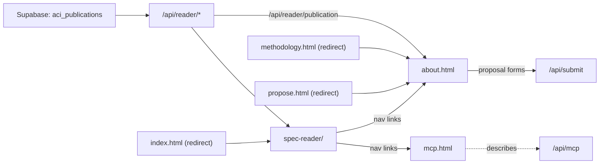

# site/: the public pages and the reader, served by the Next.js application

> Current-state doc: describes what exists now, not what should exist. Brought current in September 2026.

## Purpose

The public presentation layer. Plain HTML and vanilla JS, with no framework and no build step of its own: `predev` and `prebuild` in `package.json` copy `site/` into the gitignored `public/`, and the Next.js application serves it from there. The application is deployed on Vercel at https://ai-character-index.vercel.app, which builds on a push. `next.config.mjs` gives the prose pages names (`/about`, `/mcp`) and hands `/` and `/spec-reader/` their index files.

No data lives here. The reader and the pages fetch it from the application's routes, which read the current public publication out of Supabase: `/api/reader/documents`, `/api/reader/payload`, `/api/reader/behaviours` and `/api/reader/publication`. A `?publication=` pin reaches any publication, public or draft. `/api/feedback` is the one route among these the reader posts to, from the note dialog on a paragraph or a document.

## Contents

| Path | What it is |
|---|---|
| `index.html` | Minimal redirect to `spec-reader/`, which is the landing surface. The core-page prototype it carried is retired; its design history lives in `design/`. |
| `about.html` | Served at `/about`; `/how-it-works`, its address until 18 September 2026, redirects there. What the index is and which documents it reads, how passages are judged and depths given, what it does not tell you, how to cite a passage or the index (its citation block reads `/api/reader/publication`), Andrés Cotton's original tool, and running it yourself. It carries both proposal forms, a new model spec and a new behaviour, in a dialog opened from a button in each section; both forms post to `/api/submit`. |
| `mcp.html` | Served at `/mcp`. How to connect to the public MCP endpoint, `/api/mcp`: streamable HTTP, no account, four read-only tools, the first of them an introduction an assistant reads before the others. |
| `overview.html`, `overview.js`, `constitutions.js`, `constitutions.json`, `governance.js`, `governance.json` | The front page, served at `/` and `/overview`: two views of one board (`board.js`) behind tabs, and `overview.js` owns only the tabs and the address. The first view is `constitutions.js`, which reads the written file `constitutions.json` and no route at all: the final score out of 20 at the top, the document as a whole out of 10 opening into its five criteria out of 2, and each behaviour category opening into its behaviours out of 10, with companies ranked by the final score. Every figure and every sentence a popover shows comes out of that file; the two scales are written once under the table and never inside a popover, and nothing on it says how the figures were arrived at. A company that publishes no constitution scores nought rather than NA. The second view, `?view=governance`, is unchanged: how each company governs its model spec, from `governance.json`, which is editorial. |
| `coverage.html`, `coverage.js` | The board the front page led with until 23 September 2026, served at `/coverage`. It is built from the publication the site is serving, on the same rows, and it is the one board whose figures open on the passages behind them and on the contradictions in the sheet. The front board links to it in one line, carrying the publication its own file names. |
| `board.css` | The stylesheet both board pages link, which was the `<style>` block of `overview.html` until the coverage board moved to a page of its own. |
| `company-marks.js` | The mark of each company, drawn above its name on both boards of the front page: one path each, filled with `currentColor` so the colour is the stylesheet's, hidden from assistive technology because the name under it is what is read out. The drawings are Simple Icons (CC0 1.0), copied in as path data; the set carries none for OpenAI or xAI, and those two keep the space and show their name alone. || `depth-scale.js` | The depth scales a publication can carry, 0 to 4 and 0 to 10: their levels, the rubric's own sentence for each and the one line the board prints, the words said beside a figure, and the colour ramp. One module, imported by `overview.js`, `board.js` and `spec-reader/app.js`; a payload's `depthScale` says which scale it is on, and none means 4. `engine/panel/test_site_rubrics.py` holds the scale of ten to the prompt the judges read. |
| `board.js` | The board both views of the overview draw: one table with the labs across and the figures down, each row painted over its own maximum, each group opening into its rows, and one popover placed beside whatever was pressed. It knows nothing of labs, checks, behaviours or criteria; a view brings its own data and the text of its own popovers. Imported by `overview.js` and `governance.js`. |
| `document-assessment.js` | What the board says about a document's assessment as a whole on a publication out of ten: the five criteria in the prompts' own words with their anchors, the halving that puts each out of 2 and the document out of 10, the behaviours' mean, a category's mean, the final score out of 20, the order of the contradictions, and who judged, read out of the payload. Pure; imported by `overview.js`. |
| `methodology.html` | A redirect to `/about`, kept because links to it are already shared. It no longer carries prose. |
| `propose.html` | A redirect to `/about`, kept for the same reason. The proposal forms moved to `about.html`. |
| `spec-reader/` | The spec reader: the documents of the current publication, a behaviour menu that highlights the passages judged to bear on each behaviour, each judge's verdict scored client-side into defining, core and related bands, and the depth the panel gave each document. It also carries the note dialog, opened from a paragraph's own icon or a document's, and posts what it collects to `/api/feedback`. It has its own `README.md`. |
| `README.md` | Short layer status. |

## Relationships

- Producers: `engine/build-spec-reader-data.py` builds the documents payload and `engine/panel/build_site_data.py` the behaviour payload. `engine/publish.py` materialises both into a row of `aci_publications`, and `app/api/reader/` serves the public one.
- The proposal forms on `about.html` post to `app/api/submit/`, which records a proposal in `aci_submissions`, stores its document in a private bucket and tells Slack. It registers and judges nothing.
- `engine/verify-reader-test.mjs` and `engine/verify-reader-features.mjs` boot Chrome against `site/`, answering the reader's routes from `tests/fixtures/reader/` rather than the database; CI's browser job runs both. The `engine/panel/test_appjs_*.js` harnesses test `spec-reader/app.js` without a browser.

## Dependency map

## As-is observations

- No page of the site states the depth rubric in full. `about.html` gives the ends of the scale, and the rubric itself is `methodology/spec-coverage-depth-rubric.md`.
- The verifiers hardcode the reader's DOM selectors, so a markup refactor can silently invalidate the only end-to-end checks.
