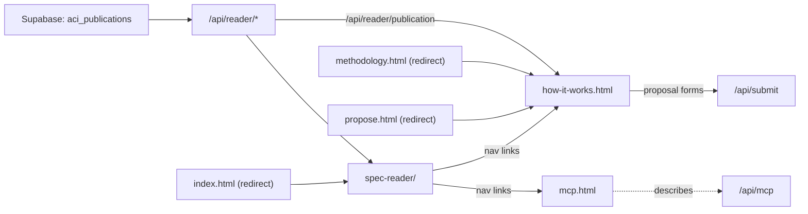

# site/: the public pages and the reader, served by the Next.js application

> Current-state doc: describes what exists now, not what should exist. Brought current in September 2026.

## Purpose

The public presentation layer. Plain HTML and vanilla JS, with no framework and no build step of its own: `predev` and `prebuild` in `package.json` copy `site/` into the gitignored `public/`, and the Next.js application serves it from there. The application is deployed on Vercel at https://ai-character-index.vercel.app, which builds on a push. `next.config.mjs` gives the prose pages names (`/how-it-works`, `/mcp`) and hands `/` and `/spec-reader/` their index files.

No data lives here. The reader and the pages fetch it from the application's routes, which read the current public publication out of Supabase: `/api/reader/documents`, `/api/reader/payload`, `/api/reader/behaviours` and `/api/reader/publication`. A `?publication=` pin reaches any publication, public or draft. `/api/feedback` is the one route among these the reader posts to, from the note dialog on a paragraph or a document.

## Contents

| Path | What it is |
|---|---|
| `index.html` | Minimal redirect to `spec-reader/`, which is the landing surface. The core-page prototype it carried is retired; its design history lives in `design/`. |
| `how-it-works.html` | Served at `/how-it-works`. What the index is and which documents it reads, how passages are judged and depths given, what it does not tell you, how to cite a passage or the index (its citation block reads `/api/reader/publication`), Andrés Cotton's original tool, and running it yourself. It carries both proposal forms, a new model spec and a new behaviour, in a dialog opened from a button in each section; both forms post to `/api/submit`. |
| `mcp.html` | Served at `/mcp`. How to connect to the public MCP endpoint, `/api/mcp`: streamable HTTP, no account, four read-only tools, the first of them an introduction an assistant reads before the others. |
| `overview.html`, `overview.js`, `governance.js`, `governance.json` | The front page, served at `/` and `/overview`, in two views behind tabs. The first is the grid of how deeply each specification covers each behaviour, read from the current publication. The second, `?view=governance`, is a board of how each lab governs its model spec: one table with the nine labs across and their scores down, each of the four questions opening into its checks, and a popover with the evidence behind any score. Its scores and text are editorial, from a research note of 18 September 2026 in its second pass, and live in `governance.json` rather than in the database. |
| `methodology.html` | A redirect to `/how-it-works`, kept because links to it are already shared. It no longer carries prose. |
| `propose.html` | A redirect to `/how-it-works`, kept for the same reason. The proposal forms moved to `how-it-works.html`. |
| `spec-reader/` | The spec reader: the documents of the current publication, a behaviour menu that highlights the passages judged to bear on each behaviour, each judge's verdict scored client-side into defining, core and related bands, and the depth the panel gave each document. It also carries the note dialog, opened from a paragraph's own icon or a document's, and posts what it collects to `/api/feedback`. It has its own `README.md`. |
| `README.md` | Short layer status. |

## Relationships

- Producers: `engine/build-spec-reader-data.py` builds the documents payload and `engine/panel/build_site_data.py` the behaviour payload. `engine/publish.py` materialises both into a row of `aci_publications`, and `app/api/reader/` serves the public one.
- The proposal forms on `how-it-works.html` post to `app/api/submit/`, which records a proposal in `aci_submissions`, stores its document in a private bucket and tells Slack. It registers and judges nothing.
- `engine/verify-reader-test.mjs` and `engine/verify-reader-features.mjs` boot Chrome against `site/`, answering the reader's routes from `tests/fixtures/reader/` rather than the database; CI's browser job runs both. The `engine/panel/test_appjs_*.js` harnesses test `spec-reader/app.js` without a browser.

## Dependency map

## As-is observations

- No page of the site states the depth rubric in full. `how-it-works.html` gives the ends of the scale, and the rubric itself is `methodology/spec-coverage-depth-rubric.md`.
- The verifiers hardcode the reader's DOM selectors, so a markup refactor can silently invalidate the only end-to-end checks.
