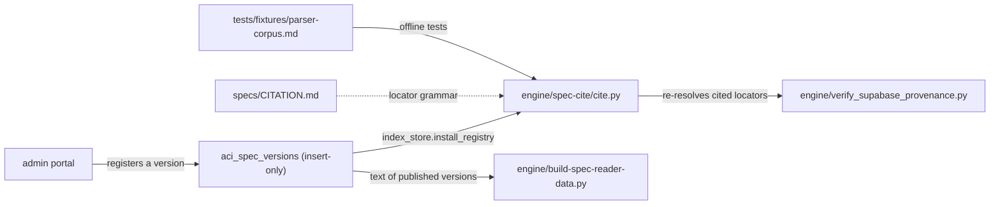

> **The spec texts are no longer here.** They live in `aci_spec_versions`,
> insert-only and keyed by content digest, which is what makes the byte-exact
> citation guarantee structural. What remains in this directory is the locator
> grammar (`CITATION.md`) and each mirror's provenance note — documents about
> the data rather than the data.

# specs/: the locator grammar, and the provenance notes of the mirrors that used to live here
> Current-state doc, as of September 2026: describes what exists now, not what should exist.

## Purpose
`CITATION.md` defines the locator grammar that makes every stored quote resolvable to an exact span. The two upstream readmes and their licence files are kept from the mirrors that used to live here. The texts themselves are rows of `aci_spec_versions`, and `engine/spec-cite/cite.py` resolves a locator only against a registry installed from those rows or from a fixture.

## Contents
| Path | Holds |
|---|---|
| `CITATION.md` | Locator format `<spec>@<version> > <section-ref> > ¶<n>[ s<a>[-<b>]]` (`>` / `›` interchangeable); section refs are `#anchor` for the Model Spec and heading-title paths for the constitution; block (¶) and sentence (s) counting rules; the three mechanical normalizations applied to quotes; cite.py command reference |
| `claude-constitution/README.md`, `LICENSE` | Upstream readme under a provenance note, and the CC0 1.0 licence |
| `openai-model-spec/README.md` | Upstream readme under a provenance note |
| `openai-model-spec/CHANGELOG.md` | Upstream changelog, v2024.05.08 → v2025.12.18 |

## Relationships
Nothing writes here. Documents and versions are registered through the admin portal into `aci_spec_versions`; as of September 2026 the public publication reads four of them: Claude's Constitution 2026-01-20, the OpenAI Model Spec 2025-12-18 and 2026-08-18, and the Alibaba Model Spec 2026-04-00. `engine/index_store.py` installs them as `cite.py`'s registry under `<lab>--<document>` names. `cite.py` implements the grammar in code and does not read `CITATION.md`. Its offline tests resolve against `tests/fixtures/parser-corpus.md`, and `engine/verify_supabase_provenance.py` re-resolves a publication's locators against the stored text. `engine/build-spec-reader-data.py` puts the text of every version a publication carries into its documents payload.

## Dependency map

## As-is observations
- `CITATION.md` still describes the pre-migration arrangement in places: its examples use the old names (`constitution@2026-01-20`, `model-spec@2025-12-18`) where stored locators now read `anthropic--constitution@…` and `openai--model-spec@…`, and it says CI re-resolves locators against `specs/` and that a new version is registered in `BUNDLED_SPECS` or the user manifest, none of which exists.
- `engine/spec-watch/pull-latest.sh` no longer runs (it reads `cite.BUNDLED_SPECS`), and nothing detects when a lab publishes a new version.
- The old document names `constitution` and `model-spec` remain in the database beside their `<lab>--<document>` copies until the cleanup migration deletes them.
- The constitution has no anchors, so its locators depend on exact heading-title paths; `CITATION.md` notes a trailing path subset resolves "when unique" today, and stored citations should carry full paths to survive future duplicate titles.
