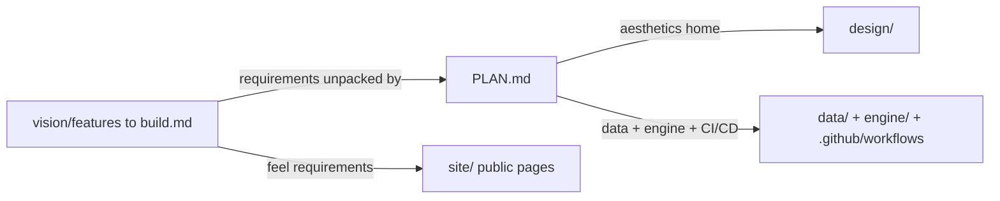

> **A dated archive (as of September 2026).** The brief predates PLAN.md (10 July 2026) and this overview describes the repository of 18 August 2026; its statements about the current tree, such as which workflows exist, are out of date.

# vision/ — the originating brief: what the project should feel like and the conceptual proposal it grew from

> As-is snapshot of origin/main @ 72e2e6b (2026-08-18); the documentation set itself is added by this PR. Describes what exists now, not what should exist.

## Purpose
Holds the original vision material that motivated the repo: a requirements/feel brief ("features to build") plus the embedded conceptual project proposal ("AI character index / Model specs org", by Andrés Cotton). It is the why and the product requirements, upstream of `PLAN.md`'s how.

## Contents
| Path | Holds |
|---|---|
| `features to build.md` | A goal statement ("convert this conceptual project into a living web-page with the engine that keeps it updated"), a "General feel" list (rigorous/trustworthy, clarity + convergence of opinions, contributable with clear channels, transparent criteria/mechanisms), a Considerations list (eval submission, appeals, promoting well-made evals, Notion→webpage sync with a "push to production" gate, clear system design, an aesthetics folder, page-info sketches, minimal CI/CD), a Future note (eval-submission backend + auto rubric scoring), and the full embedded conceptual proposal |
| (embedded proposal) | Theory of change (spec inertia), desired outcomes, hypotheses to test, scope & deliverables (derisking sprint → month-2 public index), "why me", success measures, advisor, open questions, and references |

## Relationships
This is the upstream source for `PLAN.md`, which explicitly unpacks the vision's requirements: PLAN §4 maps the four "general feel" items to concrete features, §1.3 covers the eval-submission/appeal channels, §1.2/§5 cover the "minimal CI/CD" and Notion→PR→publish gate, and §8 assigns aesthetics to `design/`. The "aesthetics folder" the vision asks for is `design/`. Root `README.md` links `vision/` as "the original vision documents, including features to build". `PLAN.md` and `README.md` both reference it; it is not consumed by any build, schema, or render step.

## Dependency map

## As-is observations
- The directory contains exactly one file; the filename `features to build.md` has spaces (no hyphens), so references URL-encode it as `features%20to%20build.md`.
- The vision's own open question about "contradictions" in specs cites arXiv:2510.07686; the closing paragraph of `PLAN.md` §6 (Build phases) lists it as explicitly out-of-v0-scope — the tension is unresolved, only parked.
- Several vision items are only partially realized in the current tree: the "submit an eval / appeal" intake is carried only by the repo's contact link (dedicated forms are out of scope for the model-spec-reader deliverable), and the Future "backend that auto-scores submissions" plus several workflows named in `PLAN.md` (`notion-sync.yml`, `spec-watch.yml`, `ci.yml`) are not present — only `deploy.yml` exists under `.github/workflows/`, and `engine/notion-sync/` is an empty `.gitkeep` placeholder.
- The vision is dated (references 2026-06 sources and a "month-2 goal") and predates the staged sweep pipeline, the depth rubric, and the consolidated spec reader; it is not updated to reflect them.
- The embedded proposal mixes product requirements with pitch content (why-I'm-a-good-fit, advisor, stakeholder questions) that has no downstream technical consumer.
